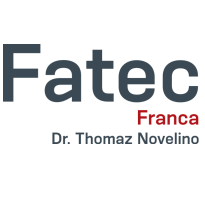

# Hello, my name is Victor!

  

  

  👨‍💻 Data Analyst Intern at Compass.UOL   
  👨‍🎓 Systems Analysis and Development Student   
  💬 Always keep learning...   
  💌 Contact me: ⤵️   

  

  

  

  

## 🚀 My main skills

### Front-end

### Back-end

### Database

### Others

 

## <b>📘 Academic education </b>

  

  

  **Systems Analysis and Development**  
  [**FATEC Franca**](https://site.fatecfranca.edu.br) • fev/2021 > dec/2024  
  Higher education
  

  

## ➕ Additional Information

* Willingness and ease in learning.
